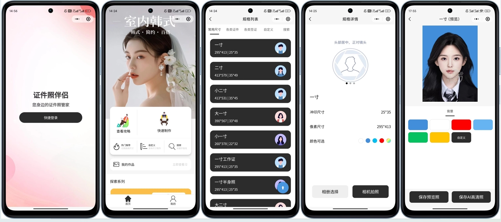
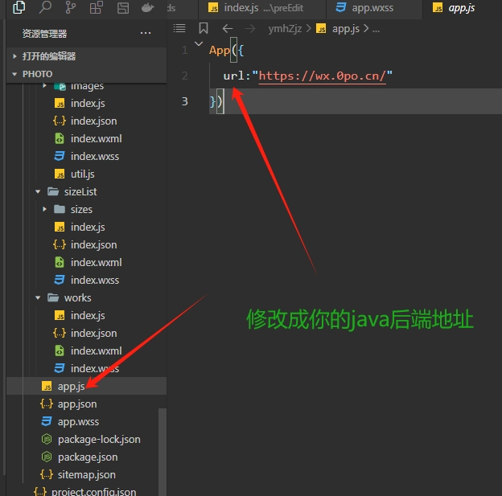

# 预览：

# 项目介绍

# 
AI智能照

我给你的，就是我想要的，我爱你的方式，就是我希望被爱的方式.

**相关项目**：

- 小程序后端地址：https://github.com/whynottogo/aiPhotoApiPublic
- 本项目基于原项目二次开发，原项目地址：https://github.com/no1xuan/zjzWx

------

# ⭐最近更新
- 2024.10.10: 新增拍照技巧页面可配置功能
- 2024.10.10: 新增黑白照片AI智能上策功能，修复拍照页面无法返回的问题
- 2024.10.07: 增加抠图功能，新增退出登录
- 2024.09.23: 增加个人中心，优化拍照技巧，优化定制尺寸，修复首点击部分功能会出现重复跳转2次的问题
- 2024.09.21: 修复我的作品无法下载问题
- 2024.09.20: 根据微信热力图优化体验，加大首页按钮点击范围，修复分页后删除作品页面没变化，增加温馨提示
- 2024.09.19: 增加看广告视频下载功能
- 2024.09.14: 根据群友建议缩短弹窗时间，修复白色背景生成出来是黑色的问题，修复离开小程序就掉登录的问题
- 2024.09.13: 根据微信热力图优化用户体验
- 2024.09.12: 第一个版本诞生
------

# 🔧部署

微信开发者工具打开项目后，修改一个地址就好啦

## 隐私协议

## 客服配置

## 📧其它

您可以通过以下方式联系我:

QQ: 43883407

微信：shynin
